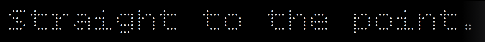

<!-- Title -->

  </img>

<!-- Repositories -->

  <strong>Repositories</strong> 🐦‍⬛
  
  

<!-- Banner -->

  </img>

 
<!-- Tech Stack -->

   
   
   
   
  
  
  
  
  
   
  
   
   
   
   
  
  
  
  
  
   

<!-- Tech Stack -->

  
 &nbsp;
 
  
 
 
  
 
 

<!-- Tech Stack -->

 
 
 
  
 
 
  
 
  
 

<!-- Tech Stack -->

  

  &nbsp;
  &nbsp;

  &nbsp;
  &nbsp;
  &nbsp;
 

  &nbsp;

  &nbsp;

  &nbsp;
  &nbsp;

  &nbsp;
 

  &nbsp;
  &nbsp;
  &nbsp;
  &nbsp;
  &nbsp;

  &nbsp;
  &nbsp;

  &nbsp;
  &nbsp;
  &nbsp;

  &nbsp;
  &nbsp;
  

  
  
  

<!-- Tech Stack -->

  
  
   
  
  

<!-- IDE -->

  

 

---

