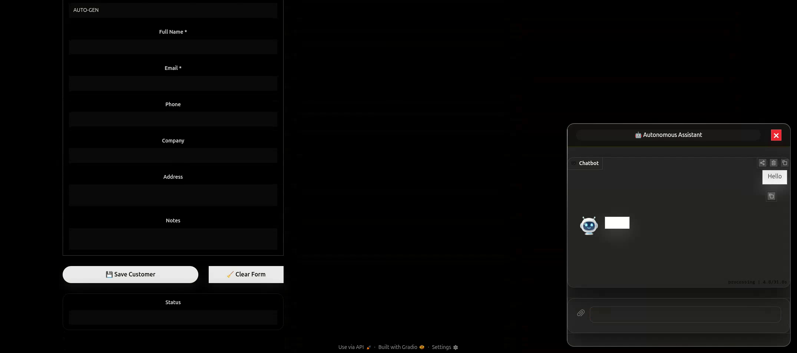

 </img>

# Straight to the point. 🖤

I'm **RealRaven** — an independent AI & Robotics developer focused on building systems that actually work, unrestricted & unregulated on local hardware.

### What I build
- 🧬 Advanced memory systems with ChromaDB, LangChain, RAG
- 🪶 GRPO training frameworks for single-consumer-GPU (RTX4090) with vllm 0.22.1 and own TRL (ForgeLoopGRPO)
- 🐦‍⬛ Autonomous robotics software & kits
- 🦾 AI Agents Software & Finetuning (SFT, GRPO, ORPO, DPO, PPO) 
- 🤖 Custom RAG pipelines and reinforcement learning systems

### Currently working on
- 🔼 Scaling my memory architecture
- 🌎 Preparing robotics kits for real-world deployment

### Skills
- 🐍 (Main) Python, C#, C/C++, JavaScript, PHP 💻
- ⛓️ LangChain, RAG, GRPO/ORPO/DPO, Docker 🐳
- 🔌 ROS, Arduino, Raspberry Pi, hardware prototyping ⚙️
- 🏛️ Fullstack development & system architecture 🌕

---

**"Real work. Real results. No shortcuts."**

Feel free to explore my repositories.
Open to interesting collaborations in AI and robotics.

<!--
**RealRaven/RealRaven** is a ✨ _special_ ✨ repository because its `README.md` (this file) appears on your GitHub profile.

Here are some ideas to get you started:

- 🔭 I’m currently working on ...
- 🌱 I’m currently learning ...
- 👯 I’m looking to collaborate on ...
- 🤔 I’m looking for help with ...
- 💬 Ask me about ...
- 📫 How to reach me: ...
- 😄 Pronouns: ...
- ⚡ Fun fact: ...
-->
